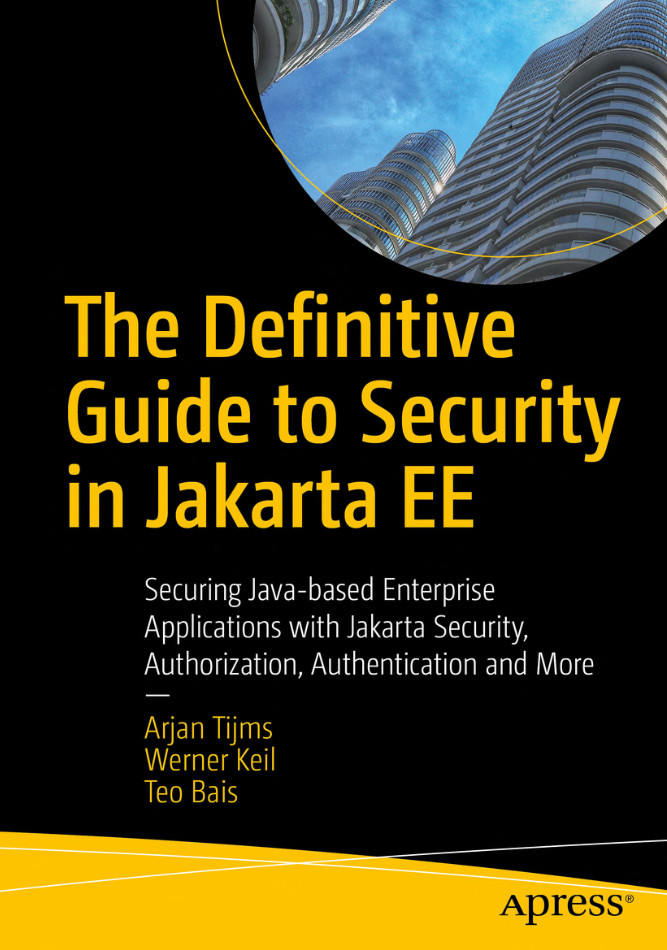

### Hi there 👋

I am a programmer who nowadays enjoys improving agile processes and engineering culture. I contributed or created open source projects with over 3 million downloads (JSR-385, Jasmine, percircle, math.js, and others). Besides, I have the honor to be the Founder & Leader of <a href="https://www.meetup.com/Utrecht-Java-User-Group">Utrecht JUG</a>. I serve JSR-385, an award-winning JSR, as an EG Member and was nominated as JCP Participant of the Year in 2019.

- 🔭 I’m currently working on The Definitive Guide to Security in Jakarta EE (**available for preorder**) - 

- 🌱 Currently, I am an Executive MBA candidate at TIAS School for Business and Society. If you feel my contributions to the software community are helpful, I would appreciate it if you could support my journey. You can find the gofundme campaign <a href="https://www.gofundme.com/f/help-thodoris-inspire-more-people-with-his-mba">here</a> and the corresponding LinkedIn post <a href="https://www.linkedin.com/posts/activity-6866794800570601472-dFz0">here</a>

- 💬 Ask me about career development, startups, presentations, public speaking, and mindset

- ☕ [Buy me a coffee](https://paypal.me/thodorisbais)
